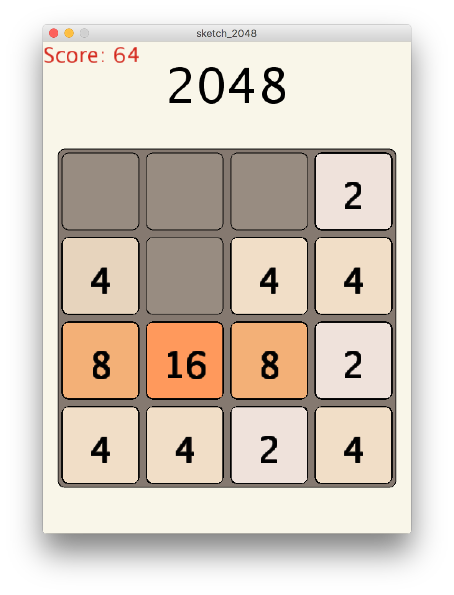
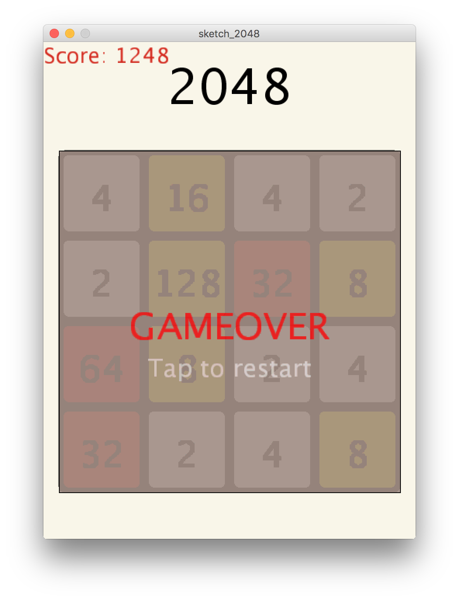

# 2048onProcessing

* This is my second work on Processing, 2048 clone.
* It took a long time, almost 6 hours. Also, my code is not clean and smart.
* But it works!
* I tried to use it on Processing.js, but it does not work well.
* Enjoy!

---
Powerd by @ryoppippi
